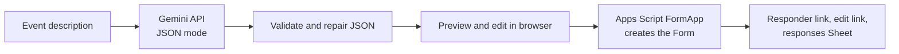

# Random Everyday Agent: AI Event Feedback Form Generator

Describe an event in plain English and get a **real Google Form** for collecting feedback, with questions tailored to the event's purpose, activities and technical setup.

Built for the **CS Week AI Automation Competition** (Everyday Use track).

| | |
|---|---|
| **Live app** | [Open the generator](https://script.google.com/macros/s/AKfycbwYQdz3KNUU7c1eNcZjFXTgJiLhx7wK0glWQVYpusNDgSizKqS9O6VZCso1GMFEhiQ/exec) (no login needed) |
| **Demo video** | [Open Video Drive Link](https://drive.google.com/drive/folders/1xzk_b2nQTxr16-g4BIec4x5EOgwnCGgR?usp=sharing) |

## The problem
Collecting good event feedback means writing a new form for every event. Generic templates miss what actually happened: the sessions, the venue, the tools. This app writes a tailored form in seconds and creates it in Google Forms, ready to share.

## What it does
1. **Describe the event.** Paste a description, or click an example (Hackathon, Workshop, Wedding, Webinar).
2. **AI designs the form.** It detects the event type and writes 3-5 sections of questions:
   - **Purpose:** did the event meet its goal, plus a likelihood-to-recommend rating.
   - **Activities:** a rating for each session, speaker or activity named in the description, plus a "which did you enjoy most?" checkbox. It never invents activities.
   - **Technical and logistics:** venue, sound/AV, Wi-Fi, platform or stream quality, registration, food and schedule, adapted to the event type.
   - **Open feedback:** best part, what to improve, and an optional role question.
3. **Review and edit.** Change any question's wording, type (rating, multiple choice, checkboxes, dropdown, short or long answer), options and required setting. Add or remove questions and sections.
4. **Create the Google Form.** The app builds a real Google Form and a linked responses Sheet, then shows the responder link, edit link and sheet link.

### Options
- Length: short (6-8), standard (10-15) or detailed (16-22) questions
- Tone: casual or formal
- Language: English, Tamil, Hindi, Spanish, French, German
- Optional collection of respondents' email addresses
- Optional Gmail address to add the creator as an editor of the form and sheet

## How it works

- **Prompt design:** the prompt requires coverage of purpose, named activities and technical details, mixed question types, neutral wording, and no invented activities.
- **Reliability:** every response is validated. Invalid question types are fixed, choice questions with fewer than two options become open-ended questions, and empty sections are dropped. The Gemini call tries a list of models in order (`gemini-flash-latest`, `gemini-3.5-flash`, `gemini-3.1-flash-lite`), so one retired model does not break the app.
- **Hosting:** a Google Apps Script web app deployed as "Execute as: Me, Access: Anyone", so anyone can open it and test it without signing in.
- **Sharing:** the created form is shared so anyone with its edit link can edit it after signing in with a Google account, and anyone with the sheet link can view responses.

## Tech stack
- Google Apps Script (`FormApp`, `SpreadsheetApp`, `DriveApp`, `UrlFetchApp`, `HtmlService`)
- Google Gemini API (Google AI Studio key, stored in Script Properties)
- HTML, CSS and vanilla JavaScript

## Repository contents
| File | Purpose |
|---|---|
| `Code.gs` | Backend: prompt, Gemini call, validation, form and sheet creation, sharing |
| `index.html` | Frontend: input, options, editable preview, results |
| `README.md` | This file |

## Deploy your own copy
1. Go to [script.google.com](https://script.google.com) and create a new project (use a personal Gmail account).
2. Paste `Code.gs` into the default file and add an HTML file named exactly `index` containing `index.html`.
3. Get a free key from [Google AI Studio](https://aistudio.google.com/apikey). In **Project Settings > Script Properties**, add `GEMINI_KEY` with your key.
4. Select the `authorize` function and click **Run**. Accept the permission prompts.
5. Click **Deploy > New deployment > Web app**, set **Execute as: Me** and **Who has access: Anyone**, then click **Deploy**.
6. Open the web app URL. After any code change, create a **New version** under Manage deployments.

## Notes and limitations
- Generated forms are owned by the account that deployed the app.
- Anyone who has a form's edit link can edit it, so keep that link private and share only the responder link.
- Link sharing may be blocked on some school or Workspace accounts. The app shows a message if that happens.
- The Gemini free tier is rate limited. If the app reports an error, wait a minute and try again.

## Author
Akshai Krishna KP 

Mahalis Rayhan

Raihan Shamnad
